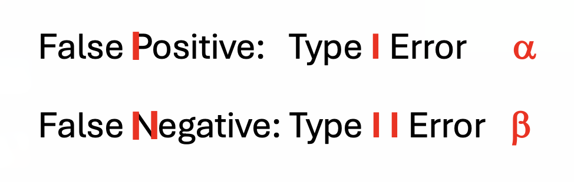
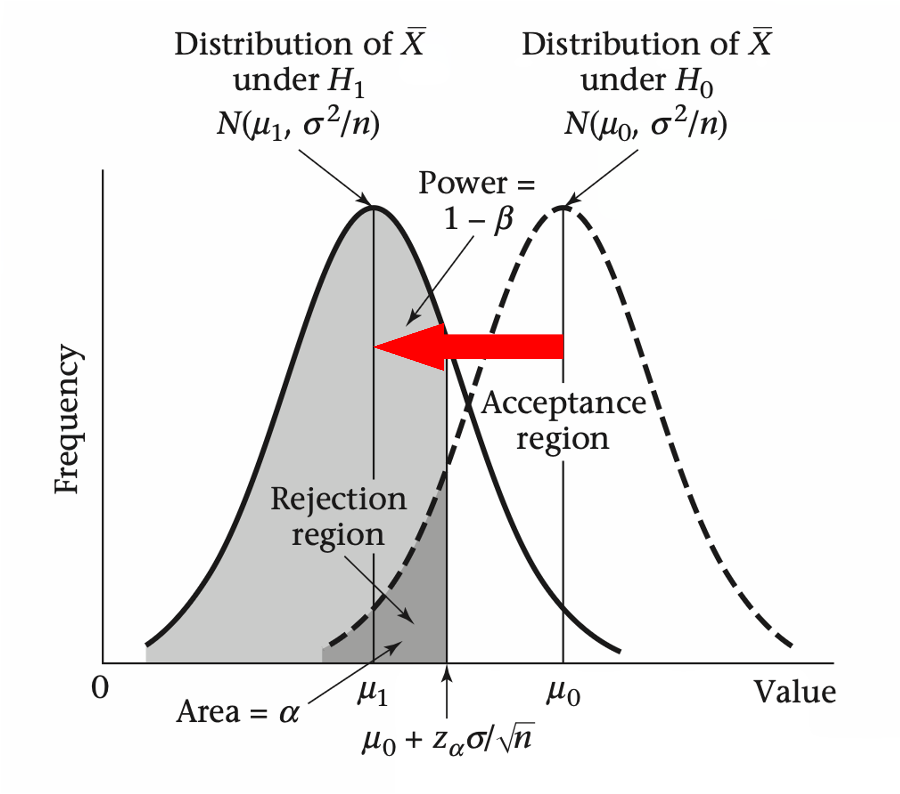
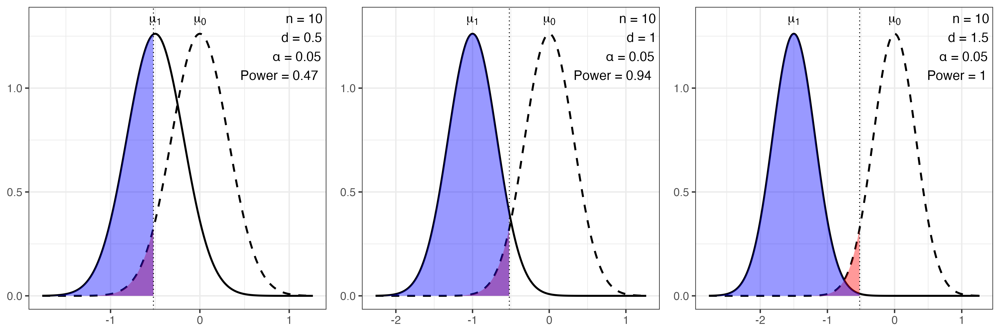
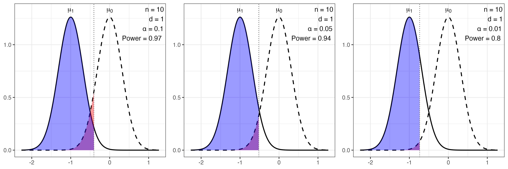
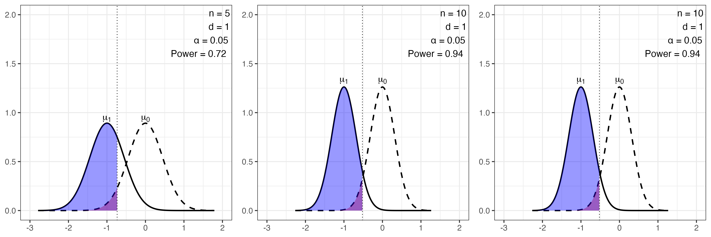

```{r setup, include=FALSE}
knitr::opts_chunk$set(echo = FALSE, warning = FALSE, message = FALSE)
```

# Introduction

Key Concepts Overview

- Hypothesis 
  - $H_0$ and $H_1$
  - Type I error ($\alpha$)
  - Type II error ($\beta$)
  
- Statistical power

- Effect size

- Critical value

- Sample size (n)

- Hands-on session

# Hypothesis 

<!-- \begin{theorem}  -->
<!--         This is a theorem.  -->
<!-- \end{theorem} -->

<!-- \begin{lemma}  -->
<!--         This is a proof idea. -->
<!-- \end{lemma} -->

\begin{definition} [C\&B.D.8.1.2]
A \textbf{hypothesis} is a statement about a population parameter.
\end{definition}

- A hypothesis makes a claim about the population  
- The goal of hypothesis testing: 
  - to use the evidence from sample data  
  - to decide which of two complementary hypotheses is more supported  


# Hypothesis 

\begin{definition} [C\&B.D.8.1.3]
The two complementary hypotheses in a hypothesis testing problem are called \textbf{the null hypothesis ($H_0$)} and \textbf{the alternative hypothesis ($H_1$)}, respectively.
\end{definition}


# Example Rosner.7.2: Obstetrics

Suppose we want to test the hypothesis that mothers with low socio-economic status (SES) deliver babies whose birthweights are lower than “normal.” To test this hypothesis, a list is obtained of birthweights from 100 consecutive, full-term, live-born deliveries from the maternity ward of a hospital in a low-SES area. The mean birthweight ($x$) is found to be 115 oz with a sample standard deviation (s) of 24 oz. Suppose we know from nationwide surveys based on millions of deliveries that the mean birthweight in the United States is 120 oz. Can we actually say the underlying mean birthweight from this hospital is lower than the national average?

- $H_0$: No effect or difference, $\mu = \mu_0$

- $H_1$: There is an effect or difference, $\mu < \mu_0$

# Hypothesis Testing 

\begin{definition} [C\&B.D.8.1.3]
A \textbf{hypothesis testing procedure} or \textbf{hypothesis test} is a rule:

For which sample values the decision is made to accept $H_0$ as true.

For which sample values $H_0$ is rejected and $H_1$ is accepted as true.

\end{definition}

- The subset of the sample space for which $H_0$ will be rejected is called the \textit{rejection region } or \textit{critical region} ($R$). 

- The complement of the rejection region ($R^C$) is called the \textit{acceptance region}.


# Hypothesis Testing Decision Table

<!-- \begin{table}[ht] -->
<!-- \centering -->
<!-- \caption{Two types of errors in hypothesis testing} -->
<!-- \begin{tabular}{c c | c c} -->
<!-- \multicolumn{2}{c}{} & \multicolumn{2}{c}{\textbf{Decision}} \\ -->
<!-- \multicolumn{2}{c}{} & Accept $H_0$ & Reject $H_0$ \\ -->
<!-- \hline -->
<!-- \multirow{2}{*}{Truth} & $H_0$ & & \\ -->
<!--                        & $H_1$ & \textcolor{red}{Type II Error}  & \textcolor{green}{Correct decision} \\ -->
<!-- \end{tabular} -->
<!-- \end{table} -->

## Rosner.T.7.1: Four possible outcomes in hypothesis testing

\begin{center}
\renewcommand{\arraystretch}{1.5}
\setlength{\tabcolsep}{10pt}
\begin{tabular}{c c | c | c}
& & \multicolumn{2}{c}{\textbf{Decision}} \\
& & Accept $H_0$ & Reject $H_0$ \\
\cline{1-4}
\multirow{3}{*}{\rotatebox{90}{\textbf{Truth}}} 
& $H_0$ 
& \begin{tabular}{c}
\textcolor{green}{$H_0$ is true} \\
\textcolor{green}{$H_0$ is accepted}
\end{tabular}
& \begin{tabular}{c}
\textcolor{red}{$H_0$ is true} \\
\textcolor{red}{$H_0$ is rejected}
\end{tabular} \\
\cline{2-4}
& $H_1$ 
& \begin{tabular}{c}
\textcolor{red}{$H_1$ is true} \\
\textcolor{red}{$H_0$ is accepted}
\end{tabular}
& \begin{tabular}{c}
\textcolor{green}{$H_1$ is true} \\
\textcolor{green}{$H_0$ is rejected}
\end{tabular} \\
\end{tabular}
\end{center}

\textcolor{gray}{careful about the header and the labels of the table, make sure they are consistent with the content of the table.}

# Hypothesis Testing Decision Table

## C\&B.T.8.3.1: Two types of errors in hypothesis testing

\begin{center}
\renewcommand{\arraystretch}{1.5}
\setlength{\tabcolsep}{10pt}
\begin{tabular}{c c|c c}
& & \multicolumn{2}{c}{\textbf{Decision}} \\
& & Accept $H_0$ & Reject $H_0$ \\
\cline{1-4}
\multirow{3}{*}{\rotatebox{90}{\textbf{Truth}}} 
& $H_0$ 
& \begin{tabular}{c}
\textcolor{green}{Correct decision} \\
\textcolor{green}{($1 - \alpha$)}
\end{tabular}
& \begin{tabular}{c}
\textcolor{red}{Type I Error}  \\
\textcolor{red}{(False Positive, $\alpha$)}
\end{tabular} \\
\cline{2-4}
& $H_1$ 
& \begin{tabular}{c}
\textcolor{red}{Type II Error}  \\
\textcolor{red}{(False Negative, $\beta$)}
\end{tabular}
& \begin{tabular}{c}
\textcolor{green}{Correct decision}  \\
\textcolor{green}{(Power = $1 - \beta$)} 
\end{tabular} \\
\end{tabular}
\end{center}

# Hypothesis Testing Decision Table

## C\&B.T.8.3.1: Two types of errors in hypothesis testing

\begin{center}
\renewcommand{\arraystretch}{1.5}
\setlength{\tabcolsep}{10pt}
\begin{tabular}{c c|c c}
& & \multicolumn{2}{c}{\textbf{Decision}} \\
& & Accept $H_0$ & Reject $H_0$ \\
\cline{1-4}
\multirow{3}{*}{\rotatebox{90}{\textbf{Truth}}} 
& $H_0$ 
& \begin{tabular}{c}
\textcolor{green}{Correct decision} \\
\textcolor{green}{($1 - \alpha$)}
\end{tabular}
& \begin{tabular}{c}
\textcolor{red}{Type I Error}  \\
\textcolor{red}{(False Positive, $\alpha$)}
\end{tabular} \\
\cline{2-4}
& $H_1$ 
& \begin{tabular}{c}
\textcolor{red}{Type II Error}  \\
\textcolor{red}{(False Negative, $\beta$)}
\end{tabular}
& \begin{tabular}{c}
\textcolor{green}{Correct decision}  \\
\textcolor{green}{(Power = $1 - \beta$)} 
\end{tabular} \\
\end{tabular}
\end{center}

```{r fig-power, out.width = "60%"}

```

# Defintions (Rosner.D.7.2 - D.7.6)

- The probability of a \textbf{Type I error} is the probability of rejecting the null hypothesis when $H_0$ is true. 


- The probability of a \textbf{Type II error} is the probability of accepting the null hypothesis when $H_1$ is true. 
This probability is a function of $\mu$ as well as other factors.


- The probability of a Type I error is usually \textbf{denoted by $\alpha$} and is commonly referred to as the significance level of a test.


- The probability of a Type II error is usually \textbf{denoted by $\beta$}.


- The \textbf{power} of a test is defined as
$1 - \beta$: $\Pr(\text{rejecting } H_0 \mid H_1 \text{ true}) = 1 - \text{probability of a Type II error}$

<!-- \begin{table} -->
<!-- \centering -->
<!-- \begin{tabular}{c|c|c} -->
<!-- \textbf{Reality} & \textbf{Reject $H_0$} & \textbf{Fail to Reject $H_0$} \\ -->
<!-- \hline -->
<!-- $H_0$ is TRUE  -->
<!-- & \begin{tabular}[c]{@{}c@{}} Type I Error \\ (False Positive, $\alpha$) \end{tabular} -->
<!-- & \begin{tabular}[c]{@{}c@{}} Correct \\ ($1 - \alpha$) \end{tabular} \\ -->
<!-- \hline -->
<!-- $H_1$ is TRUE  -->
<!-- & \begin{tabular}[c]{@{}c@{}} Correct \\ (Power = $1 - \beta$) \end{tabular} -->
<!-- & \begin{tabular}[c]{@{}c@{}} Type II Error \\ (False Negative, $\beta$) \end{tabular} \\ -->
<!-- \end{tabular} -->
<!-- \end{table} -->


<!-- \begin{table} -->
<!-- \centering -->
<!-- \begin{tabular}{c|c|c} -->
<!-- \textbf{Reality} & \textbf{Reject $H_0$} & \textbf{Fail to Reject $H_0$} \\ -->
<!-- \hline -->
<!-- $H_0$ is TRUE  -->
<!-- & \begin{tabular}[c]{@{}c@{}} Type I Error \\ (False Positive, $\alpha$) \end{tabular} -->
<!-- & \begin{tabular}[c]{@{}c@{}} Correct \\ ($1 - \alpha$) \end{tabular} \\ -->
<!-- \hline -->
<!-- $H_1$ is TRUE  -->
<!-- & \begin{tabular}[c]{@{}c@{}} Correct \\ (Power = $1 - \beta$) \end{tabular} -->
<!-- & \begin{tabular}[c]{@{}c@{}} Type II Error \\ (False Negative, $\beta$) \end{tabular} \\ -->
<!-- \end{tabular} -->
<!-- \end{table} -->

<!-- | Reality (Truth)            | Reject $H_0$                          | Fail to Reject $H_0$            | -->
<!-- |---------------------------|-----------------------------------|------------------------------| -->
<!-- | $H_0$ is TRUE                | Type I Error \\ (False Positive, $\alpha$)  | Correct \\ ($1 - \alpha$)              | -->
<!-- | $H_1$ is TRUE                | Correct \\ (Power = $1 - \beta$)           | Type II Error \\ (False Negative, $\beta$) | -->


# What is power?

## Power ($1 - \beta$)

- The ability of a statistical test to detect a relationship or difference

>- The probability of correctly rejecting the null hypothesis when the null hypothesis is false (\textcolor{red}{therefore it must be rejected}).

>- Jacob Cohen is the father of power analysis

>- Normally we accept power as 0.80 or higher
  - some say > 0.70 enough
  - some say > 0.90 excellent
  
>- Power analysis is set before data collection (*a priori*)
  - controversially, people also do *post-hoc* power analysis


# Example Rosner.7.2: Obstetrics

Power Function for One-Sided Test ($H_1: \mu < \mu_0$)}

To test
$H_0: \mu = \mu_0 \quad \text{vs.} \quad H_1: \mu < \mu_0$

\begin{align*}
\text{Power} 
&= \Pr(\text{reject } H_0 \mid H_0 \text{ false}) \\
&= \Pr\left(Z < z_{\alpha} \mid \mu = \mu_1 \right) \\
&= \Pr\left( \frac{\bar{X} - \mu_0}{\sigma/\sqrt{n}} < z_{\alpha} \,\middle|\, \mu = \mu_1 \right) \\
&= \Pr\left( \bar{X} < \mu_0 + z_{\alpha}\frac{\sigma}{\sqrt{n}} \,\middle|\, \mu = \mu_1 \right)
\end{align*}

Under $H_1$, we know:$\bar{X} \sim N\left(\mu_1, \frac{\sigma^2}{n}\right)$

Hence, standardizing:
\begin{align*}
\text{Power}
&= \Phi\left( \frac{\mu_0 + z_{\alpha}\frac{\sigma}{\sqrt{n}} - \mu_1}{\sigma/\sqrt{n}} \right) = \Phi\left( z_{\alpha} + \frac{\mu_0 - \mu_1}{\sigma}\sqrt{n} \right)
\end{align*}


# Solution 

\textbf{Problem:} Compute the power of the test for the birthweight data in Example 7.2 with an alternative mean of 115 oz and $\alpha = 0.05$, assuming $\sigma = 24$ oz.

$$
\mu_0 = 120,\quad \mu_1 = 115,\quad \alpha = 0.05,\quad \sigma = 24,\quad n = 100
$$

$$
\text{Power} = \Phi\left[z_{0.05} + \frac{(120 - 115)\sqrt{100}}{24}\right]
$$

$$
= \Phi\left[-1.645 + \frac{5(10)}{24}\right]
= \Phi(0.438)
= 0.669
$$


There is about a 67\% chance of detecting a significant difference at $\alpha = 0.05$.

# Factors

## Power is a function depdent on several factors: 

1. effect size  

2. $\alpha$ level

3. sample size (very important)

4. statistical test type

5. the type of design and data quality

\begin{align*}
\text{Power}
&= \Phi\left( \frac{\mu_0 + z_{\alpha}\frac{\sigma}{\sqrt{n}} - \mu_1}{\sigma/\sqrt{n}} \right) = \Phi\left( z_{\alpha} + \frac{\mu_0 - \mu_1}{\sigma}\sqrt{n} \right)
\end{align*}

# Effect size

- Effect size is the quantitative measure of the relationship or difference that we want to detect

- Emphasizes the size of the relationship or difference

- Examples:
  - Cohen's $d$ for mean differences for t-test
  - Pearson's $r$ and $R^2$ for correlations
  - The regression coefficients in a regression ($\beta_0$, $\beta_1$, etc.)
  - The mean differences in ANOVA ($\eta$)


# Effect Size

```{r "figure-overall", out.width = "60%", fig.align="center"}

```

\textcolor{gray}{In real life, we cannot change the level of the effect size. The effect size is determined by the nature of the population phenomenon.}


# Effect size 

- If the effect size is small, 
then we will need more subjects to find a significant results.

- If the effect size is large, 
then we do not need many subjects to find a significant results (10 or fewer).


```{r code-power-d, eval = FALSE, include = FALSE}
power_plot7 <- power_plot_left(n = 10, alpha = 0.05, d = 0.5)
power_plot7$plot
power_plot8 <- power_plot_left(n = 10, alpha = 0.05, d = 1)
power_plot8$plot
power_plot9 <- power_plot_left(n = 10, alpha = 0.05, d = 1.5)
power_plot9$plot

library(gridExtra)
combined_plot <- grid.arrange(power_plot7$plot,
                              power_plot8$plot,
                              power_plot9$plot,
                              ncol = 3)

# Save
ggsave("figure/power_plots_row2.png",
       combined_plot,
       width = 15, height = 5, dpi = 300)
```


```{r fig-power-d, out.width = "100%"}

```
\textcolor{gray}{In real life, we cannot change the level of the effect size. The effect size is determined by the nature of the population phenomenon.}


# Cirtical Values Effect

```{r "fig-power-alpha", out.width = "100%"}

```


# Sample Size Effect

```{r "code-power-ss", eval=FALSE, include=FALSE}
power_plot4 <- 
  power_plot_left(n = 5, 
                  alpha = 0.05,
                  d = 1)
power_plot5 <- 
  power_plot_left(n = 10, 
                  alpha = 0.05, 
                  d = 1)
power_plot6 <- 
  power_plot_left(n = 15, 
                  alpha = 0.05, 
                  d = 1)

combined_plot <- grid.arrange(power_plot4$plot + xlim(-3, 2) + ylim(0, 2),
                              power_plot5$plot + xlim(-3, 2) + ylim(0, 2),
                              power_plot6$plot + xlim(-3, 2) + ylim(0, 2),
                              ncol = 3)

# Save
ggsave("figure/power_plots_row3.png",
       combined_plot,
       width = 15, height = 5, dpi = 300)
```

```{r “fig-power-ss”, out.width = "100%"}

```

# How to improve power (APRONS)

## Example Rosner.7.2: Obstetrics

$$\text{Power} = \Phi(0.438) = 0.669$$

- Relax **A**lpha

- **P**arametric Statstic

- **R**eliability

- **O**ne-tailed test

- increase sample size **N** 

- **S**ensitivity of the analysis 

# Computational Tools

- How to estimate the sample size need to have adequate power

- Where to get the effect size - previous studies

- Alpha level, conventionally 0.05, but can be relaxed to larger values

- Software: [G*Power](https://www.psychologie.hhu.de/arbeitsgruppen/allgemeine-psychologie-und-arbeitspsychologie/gpower), R packages (e.g., pwr)

- [Github repositories](https://github.com/Goodgolden/interview_power) for power analysis examples and practices!

# The last slide

## *post hoc* Type III Error

The **direction** of the effect is opposite to what we expected.

```{r, out.width="100%", fig.align="center", fig.show="hold"}
knitr::include_graphics(c("figure/Picture3.png"))
```
